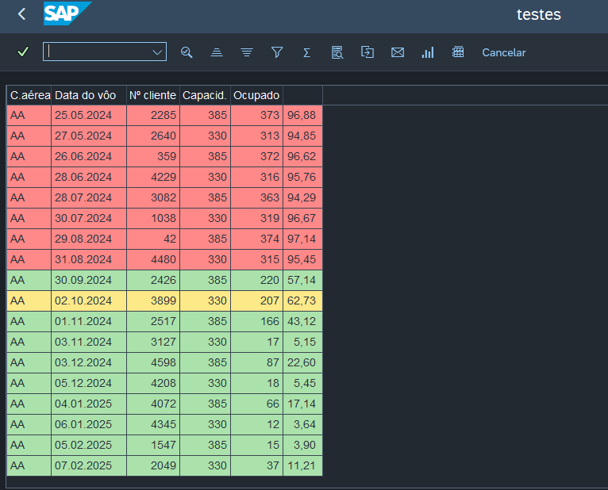

# ✈️ Relatório de Ocupação de Voos (SALV Table)

Um relatório prático desenvolvido em **ABAP** para analisar a taxa de ocupação de voos utilizando dados das tabelas de treinamento do SAP (`SFLIGHT`, `SCARR`, e `SBOOK`). O resultado é exibido em uma interface **SALV Table** com formatação condicional de cores.

## 🎯 O que este código faz?
* Faz um JOIN entre as tabelas padrão de voos do SAP.
* Calcula a porcentagem de ocupação baseada no limite e ocupação atual de assentos (`seatsmax` e `seatsocc`).
* Pinta as linhas do ALV de forma dinâmica:
  * 🔴 **Vermelho:** Ocupação >= 90% (Crítico)
  * 🟡 **Amarelo:** Ocupação >= 60% (Atenção)
  * 🟢 **Verde:** Ocupação < 60% (Tranquilo)
* Possui um filtro via tela de seleção (`CHECKBOX`) para exibir apenas os voos com status crítico.

## 📸 Demonstração
<!-- Adicione um print do seu ALV na pasta assets e descomente a linha abaixo -->
<!--  -->

## 📂 Estrutura de Arquivos
- `/src/ZADTESTES2.abap`: Código-fonte principal contendo a tela de seleção e as lógicas do SALV.

## 🚀 Como executar
1. Crie um programa executável (Report) via transação `SE38` ou `SE80` no seu ambiente SAP.
2. Copie o código contido no diretório `src`.
3. Ative o programa (Ctrl + F3) e execute (F8).
4. Informe os parâmetros na tela de seleção e aproveite!
